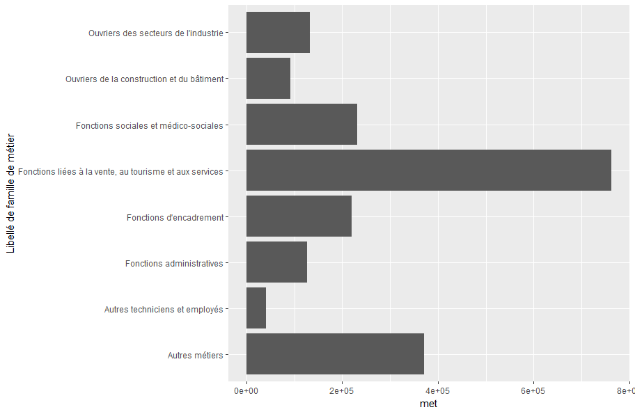
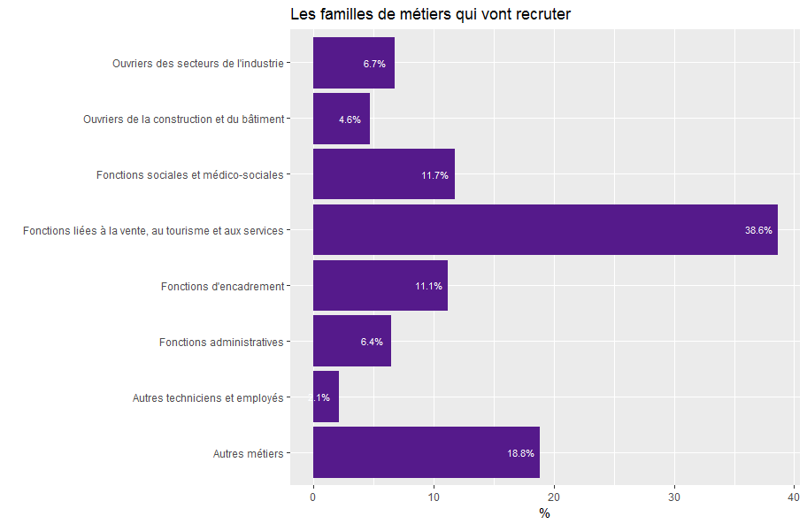
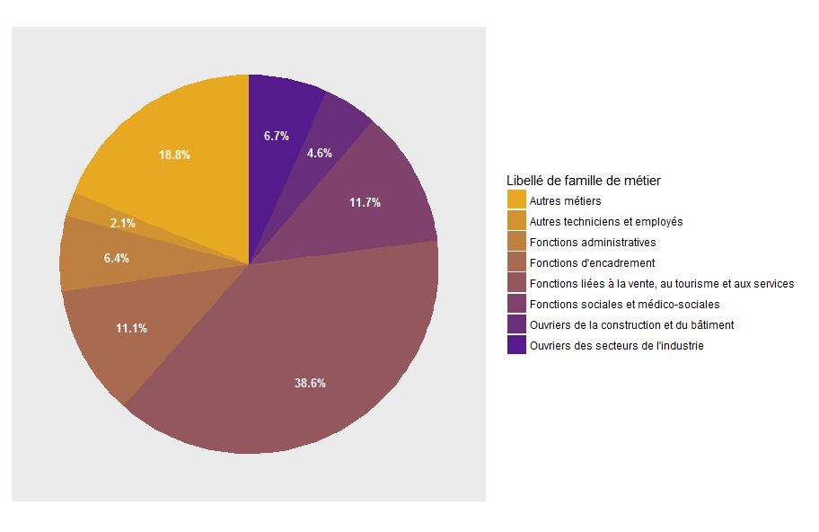
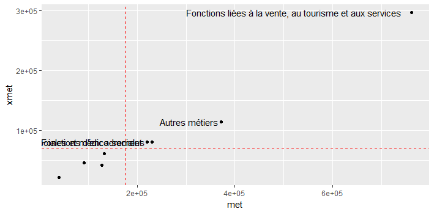
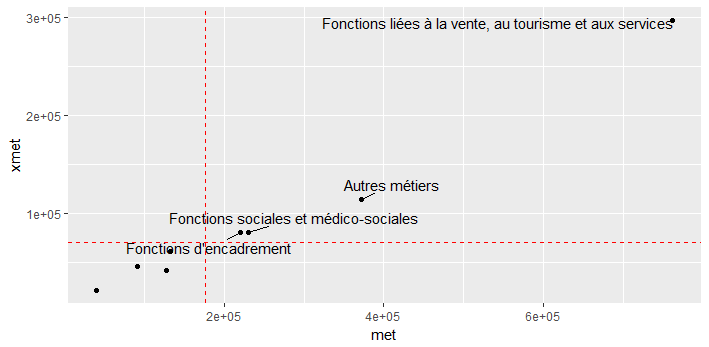
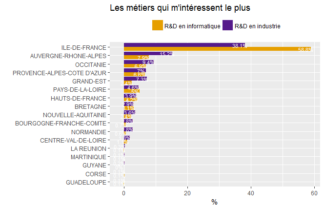
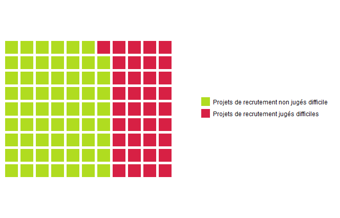
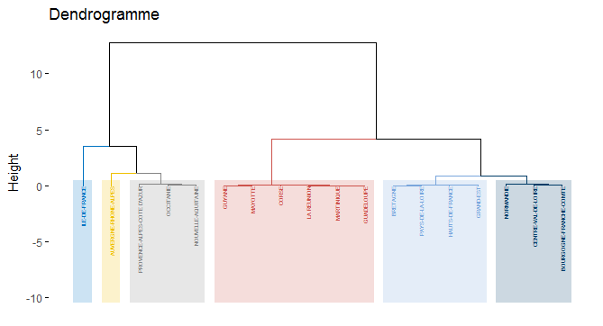
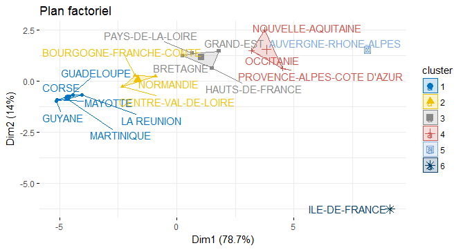

```{r setup, include=FALSE, warning=FALSE,message=FALSE}
library(learnr)
knitr::opts_chunk$set(echo = TRUE, message = FALSE,warning = F,error = F)
library(WDI)
# NY.GDP.PCAP.PP.KD (GDP per capita, PPP (constant 2005 international $)) 
```

# Exercice 1  (Carte simple)

1. À l’aide de la fonction WDI du package WDI, récupérer la série du PIB par tête (NY.GDP.PCAP.PP.KD, PPP, constant 2005 international $) pour tous les pays disponibles pour l’année 2010, et stocker ces données dans un tableau que l’on appellera gdp_capita ;

```{r ecritures, exercise = TRUE, exercise.eval = FALSE}
library(WDI)
# NY.GDP.PCAP.PP.KD (GDP per capita, PPP (constant 2005 international $)) 
gdp_capita <-WDI(country = c("all"), indicator = c("NY.GDP.PCAP.PP.KD"), start = 2010, end = 2010)

```

```{r include=FALSE}
gdp_capita <-WDI(country = c("all"), indicator = c("NY.GDP.PCAP.PP.KD"), start = 2010, end = 2010)

```


2.	Dans le tableau gdp_capita, modifier la valeur de la variable country pour l’observation de la Slovaquie, pour qu’elle valle Slovakia au lieu de Slovak Republic ;

```{r  ex1_2, exercise = TRUE, exercise.eval = FALSE,echo=FALSE}

```


```{r ex1_2-solution}
library(dplyr)
library(magrittr)
gdp_capita <-gdp_capita %>%
  mutate(country = ifelse(country == "Slovak Republic", yes = "Slovakia", no = country))

```


```{r include=FALSE}
library(dplyr)
library(magrittr)
gdp_capita <-gdp_capita %>%
  mutate(country = ifelse(country == "Slovak Republic", yes = "Slovakia", no = country))

```

3.	Filtrer les observations du tableau gdp_capita pour ne conserver que les observations des pays membres de l’Union Européenne dont les noms sont contenus dans le vecteur membres_ue. Stocker le résultat dans un tableau que l’on nommera gdp_capita_eu ;

```{r  ex1_3, exercise = TRUE, exercise.eval = FALSE,echo=FALSE}

```


```{r ex1_3-solution}
membres_ue <-c("Austria", "Belgium", "Bulgaria", "Cyprus", "Croatia", "Czech Republic", "Denmark", "Estonia", "Finland", "France", "Germany", "Greece", "Hungary", "Ireland", "Italy", "Latvia", "Lithuania", "Luxembourg", "Malta", "Netherlands", "Poland", "Portugal", "Romania", "Slovakia", "Slovenia", "Spain", "Sweden", "United Kingdom")

gdp_capita_eu <-gdp_capita %>%
  filter(country %in% membres_ue)

```

```{r include=FALSE}
membres_ue <-c("Austria", "Belgium", "Bulgaria", "Cyprus", "Croatia", "Czech Republic", "Denmark", "Estonia", "Finland", "France", "Germany", "Greece", "Hungary", "Ireland", "Italy", "Latvia", "Lithuania", "Luxembourg", "Malta", "Netherlands", "Poland", "Portugal", "Romania", "Slovakia", "Slovenia", "Spain", "Sweden", "United Kingdom")

gdp_capita_eu <-gdp_capita %>%
  filter(country %in% membres_ue)
```


4.	Utiliser le package rworldmap pour récupérer les données nécessaires à la réalisation d’une carte du monde ;

```{r rworldmap, exercise = TRUE, exercise.eval = FALSE}
library(rworldmap)

world_map <- getMap()
world_df <- fortify(world_map)

```

```{r include=FALSE}
library(rworldmap)

world_map <- getMap()
world_df <- fortify(world_map)
```

5.	Afficher une carte du monde à l’aide des fonctions contenues dans le package ggplot2 ;

```{r  ex1_5, exercise = TRUE, exercise.eval = FALSE,echo=FALSE}

```


```{r ex1_5-solution}
ggplot(data = world_df, aes(x = long, y = lat, group = group)) + 
  geom_polygon() + 
  coord_quickmap()

```


6.	Modifier les échelles des axes pour faire figurer les méridiens de −60 à 60 par pas de 30 et les parallèles de −180 à 180 par pas de 45. Modifier également la projection cartographique pour choisir la projection orthographique, à l’aide de la fonction coord_map() ;

```{r  ex1_6, exercise = TRUE, exercise.eval = FALSE,echo=FALSE}

```


```{r ex1_6-solution}
ggplot(data = world_df, aes(x = long, y= lat, group=group)) +
  geom_polygon() +
  scale_y_continuous(breaks = (-2:2) * 30) +
  scale_x_continuous(breaks = (-4:4) * 45) +
  coord_map("orthographic", orientation=c(30, 20, 0))

```


7.	Joindre les informations contenues dans le tableau gdp_capita_eu au tableau contenant les données permettant la réalisation des cartes ;

```{r  ex1_7, exercise = TRUE, exercise.eval = FALSE,echo=FALSE}

```


```{r ex1_7-solution}
world_df_eu <-world_df %>%
  left_join(gdp_capita_eu, by = c("id" = "country"))

```

```{r include=FALSE}
world_df_eu <-world_df %>%
  left_join(gdp_capita_eu, by = c("id" = "country"))
```


8.	Réaliser une carte choroplèthe reflétant pour chaque pays membre de l’Union Européenne la valeur du PIB par tête de 2012 ;

```{r  ex1_8, exercise = TRUE, exercise.eval = FALSE,echo=FALSE}

```


```{r ex1_8-solution}
ggplot(data = world_df_eu,aes(x = long, y = lat, group = group, fill =
                                NY.GDP.PCAP.PP.KD)) +
  geom_polygon() +
  scale_y_continuous(breaks = (-2:2) * 30) +
  scale_x_continuous(breaks = (-4:4) * 45) +
  coord_quickmap(xlim = c(-15, 40), ylim = c(35, 70))

```

9.	Modifier les couleurs de l’échelle continue de la carte précédente, pour que les faibles valeurs du PIB par tête soient représentées en jaune, et les valeurs les plus hautes en rouge ;

```{r  ex1_9, exercise = TRUE, exercise.eval = FALSE,echo=FALSE}

```


```{r ex1_9-solution}
ggplot(data = world_df_eu,aes(x = long, y = lat, group = group, fill = NY.GDP.PCAP.PP.KD)) + 
  geom_polygon() +
  coord_quickmap(xlim = c(-15, 40), ylim = c(35, 70)) +
  scale_fill_gradient(low = "yellow", high = "red")

```

10.	Modifier les ruptures de l'échelle de couleur pour qu’elles aillent de 10000 à 100000 ; modifier égale-ment l’étiquette de ces ruptures de sorte que 35000 soit affiché comme 35k, 60000 comme 60k, etc. Enfin, ajouter un titre au graphique et retirer les titres d’axes.

```{r  ex1_10, exercise = TRUE, exercise.eval = FALSE,echo=FALSE}

```


```{r ex1_10-solution}
range(world_df_eu$NY.GDP.PCAP.PP.KD, na.rm=TRUE)
library(stringr)
ggplot(data = world_df_eu,aes(x = long, y = lat, group = group, fill = NY.GDP.PCAP.PP.KD)) + 
  geom_polygon() +
  coord_quickmap(xlim = c(-15, 40), ylim = c(35, 70)) + 
  scale_fill_gradient("",low = "yellow", high = "red",breaks = seq(1e4, 1e5, by = 25e3),labels = str_c(seq(1e4, 1e5, by = 25e3) %/% 1e3, "k")) + 
  ggtitle("2012 GDP per capita, PPP (constant 2005 international $)") + 
  xlab("") + 
  ylab("")

```


# Exercice 2

L'enquête annuelle "Besoins en Main-d'Œuvre" est, depuis plusieurs années, un élément essentiel de connaissance du marché du travail.
Chaque année, Pôle emploi adresse un questionnaire à plus de 1,6 million d’établissements afin de connaître leurs besoins en recrutement par secteur d’activité et par bassin d’emploi.

Cette enquête permet entre autre :  
* d’anticiper les difficultés de recrutement; 
* d’améliorer l’orientation des demandeurs d’emploi vers des formations ou des métiers en adéquation avec les besoins du marché du travail;  
* d’informer les demandeurs d’emploi sur l’évolution de leur marché du travail et les métiers porteurs.

Les données sont disponibles à l’adresse suivante:
https://www.data.gouv.fr/fr/datasets/enquete-besoins-en-main-doeuvre-bmo/


```{r resmet, exercise = TRUE, exercise.eval = FALSE}
library(readxl)
chemin_fichier <- system.file("extdata", "ResMetBE17.xlsx", package = "VisuR")

ResMetBE17 <- read_excel(chemin_fichier)

View(ResMetBE17)
```


1.	Réaliser un diagramme en barre pour comptabiliser les projets de recrutement par famille de métier


```{r  ex2_1, exercise = TRUE, exercise.eval = FALSE,echo=FALSE}

```


```{r ex2_1-solution}
library(ggplot2)
g1<-ggplot(ResMetBE17, aes(`Libellé de famille de métier`,met))+
  geom_bar(stat="identity")+
  coord_flip()
g1

#seconde possibilité

g1_bis<-ggplot(ResMetBE17, aes(`Libellé de famille de métier`,met))+
  geom_bar(stat="summary",fun.y = "sum")+
  coord_flip()
g1_bis
```


2.	Apporter des modifications pour un rendu plus esthétique 



```{r  ex2_2, exercise = TRUE, exercise.eval = FALSE,echo=FALSE}

```


```{r ex2_2-solution}
g2<-ggplot(ResMetBE17, aes(x=`Libellé de famille de métier`,y=met/sum(met)))+
  geom_bar(stat="identity", color="purple4")+
  scale_y_continuous(labels = scales::percent)+
  coord_flip()+
  labs(title="Les familles de métiers qui vont recruter",
       x='',
       y='%')
g2

#seconde possibilité

library(dplyr)
data_met<-ResMetBE17%>%
  group_by(`Libellé de famille de métier`)%>%
  summarise(met=sum(met))%>%
  ungroup()%>%
  mutate(pct = prop.table(met) * 100)

g2_bis<- data_met%>% 
  ggplot(aes(x=`Libellé de famille de métier`, y = pct)) + 
  geom_bar(stat = 'identity', fill="purple4",color="purple4") + 
  geom_text(aes(y = pct -1.5 ,  
                label = paste0(round(pct,1), '%')),   
            position = position_dodge(width = .9), 
            size = 3,
            color="#FFFFFF")+
  coord_flip()+
  labs(title="Les familles de métiers qui vont recruter",
       x='',
       y='%')

g2_bis

```

3.	Transformer ce graphique en diagramme sectoriel



```{r  ex2_3, exercise = TRUE, exercise.eval = FALSE,echo=FALSE}

```


```{r ex2_3-solution}
data_cam<-ResMetBE17%>%
    group_by(`Libellé de famille de métier`)%>%
    summarise(met=sum(met))%>%
    ungroup()%>%
    mutate(pct = prop.table(met) * 100,
           somcum=cumsum(pct),
           rsomcum=rev(cumsum(rev(pct))),
           milieu=rsomcum-pct/2,
           labels=paste0(round(pct,1), '%'))
  
g3<- data_cam%>% 
  ggplot(aes(x='', y = pct,fill=`Libellé de famille de métier`)) + 
  geom_bar(stat = 'identity',width = 1)+
  coord_polar(theta = "y",start = 0)+
  geom_text(aes(x=1.2, y=milieu,label=labels),
          color="#FFFFFF",
          fontface="bold",
          size=3.3
          )+
  theme(
    axis.text.x=element_blank(),
    axis.title.x = element_blank(),
    axis.title.y = element_blank(),
    panel.border = element_blank(),
    panel.grid=element_blank(),
    axis.ticks = element_blank(),
    plot.title=element_text(size=14, face="bold",hjust = 0.5, color='#797979')
    )+
  scale_fill_manual(values=colorRampPalette(c("#E7A922", "purple4"))(nrow(data_cam)))


g3

```

4. Réaliser un nuage de point (projet X difficulté) où les axes horizontaux et verticaux correspondent aux médianes des variables.



```{r  ex2_4, exercise = TRUE, exercise.eval = FALSE,echo=FALSE}

```


```{r ex2_4-solution}
Data_Nuage<-
  ResMetBE17%>%
  select(`Libellé de famille de métier`,met,xmet,smet)%>%
  group_by(`Libellé de famille de métier`)%>%
  summarise_at(vars(met,xmet,smet),funs(sum))

g4<-ggplot(Data_Nuage, aes(x=met, y=xmet))+
  geom_point()+
  geom_hline(yintercept=Data_Nuage$xmet%>%quantile(0.5), linetype="dashed", color = "red")+
  geom_vline(xintercept=Data_Nuage$met%>%quantile(0.5), linetype="dashed", color = "red")+
  geom_text(data=Data_Nuage%>%filter(met>met%>%quantile(0.5) & xmet>xmet%>%quantile(0.5)),
            aes(label=`Libellé de famille de métier`),
            hjust=1.05)

g4
```

```{r include=FALSE}
Data_Nuage<-
  ResMetBE17%>%
  select(`Libellé de famille de métier`,met,xmet,smet)%>%
  group_by(`Libellé de famille de métier`)%>%
  summarise_at(vars(met,xmet,smet),funs(sum))
```

5. Sur R il est possible d’améliorer la visibilité des labels en utilisant la fonction geom_text_repel du package ggrepel pour obtenir un graphique du type suivant :



```{r  ex2_5, exercise = TRUE, exercise.eval = FALSE,echo=FALSE}

```


```{r ex2_5-solution}
library(ggrepel)
g4bis<-ggplot(Data_Nuage, aes(x=met, y=xmet))+
  geom_point()+
  geom_hline(yintercept=Data_Nuage$xmet%>%quantile(0.5), linetype="dashed", color = "red")+
  geom_vline(xintercept=Data_Nuage$met%>%quantile(0.5), linetype="dashed", color = "red")+
  geom_text_repel(data=Data_Nuage%>%filter(met>met%>%quantile(0.5) & xmet>xmet%>%quantile(0.5)),
                  aes(label=`Libellé de famille de métier`), 
                  box.padding = unit(0.45, "lines"))

g4bis
```

6. Deux métiers vous intéressent particulièrement : 
* M2Z90	- Ingénieurs et cadres d'études, R et D en informatique, chefs de projets informatiques  
* N0Z90 - Ingénieurs et cadres d'études, recherche et développement (industrie)   


Dans quelles régions se situent les projets de recrutement les plus nombreux ?




```{r  ex2_6, exercise = TRUE, exercise.eval = FALSE,echo=FALSE}

```


```{r ex2_6-solution}
Data_Met_Int<-
  ResMetBE17%>%
  select(`code métier BMO`,`nom_metier BMO`,REG,NOM_REG,met)%>%
  filter(`code métier BMO` %in% c("M2Z90","N0Z90"))%>%
  group_by(`code métier BMO`,`nom_metier BMO`,REG,NOM_REG)%>%
  summarise_at(vars(met),funs(sum))%>%
  ungroup()%>%
  group_by(`code métier BMO`,`nom_metier BMO`)%>%
  mutate(pct = prop.table(met) * 100)


g5<- Data_Met_Int%>% 
  ggplot(aes(x=reorder(NOM_REG,pct), y = pct,fill=`nom_metier BMO`))+ 
  geom_bar(stat = 'identity',position = "dodge") + 
  geom_text(aes(y = pct -1.5 ,  
                label = paste0(round(pct,1), '%')),   
            position = position_dodge(width = .9), 
            size = 3,
            color="#FFFFFF")+
  coord_flip()+
  labs(title="Les métiers qui m'intéressent le plus",
       x='',
       y='%')+
  scale_fill_manual(values=c("#E69F00", "purple4"), 
                    name="",
                    labels=c("R&D en informatique", "R&D en industrie"))+
  theme(legend.position="top")

g5
```

7. Représenter par une infographie la part des projets de recrutement jugés difficiles




```{r  ex2_7, exercise = TRUE, exercise.eval = FALSE,echo=FALSE}

```


```{r ex2_7-solution}
library(waffle)


part_diff<-c("Projets de recrutement non jugés difficile"=(sum(ResMetBE17$met)-sum(ResMetBE17$xmet))/sum(ResMetBE17$met)*100,  
"Projets de recrutement jugés difficiles"=sum(ResMetBE17$xmet)/sum(ResMetBE17$met)*100)
waffle(part_diff, rows=9, colors=c("#B0DC20", "#D72044")) 

```


8. Réaliser une typologie des régions françaises prenant en compte les projets de recrutement, les projets de recrutement jugés difficiles, les projets de recrutement saisonniers par famille de métiers






```{r  ex2_8, exercise = TRUE, exercise.eval = FALSE,echo=FALSE}

```


```{r ex2_9-solution}
library(FactoMineR)
library(factoextra)
library(tidyr)

data_typo_met<-ResMetBE17%>%
  select(`Famille_metier`,NOM_REG,met)%>%
  group_by(`Famille_metier`,NOM_REG)%>%
  summarise_at(vars(met),funs(sum))%>%
  ungroup()%>%
  spread(`Famille_metier`,met)

nom_col_met<-paste(colnames(data_typo_met)[2:ncol(data_typo_met)],"_met",sep="")
colnames(data_typo_met)[2:ncol(data_typo_met)]<-nom_col_met

data_typo_xmet<-ResMetBE17%>%
  select(`Famille_metier`,NOM_REG,xmet)%>%
  group_by(`Famille_metier`,NOM_REG)%>%
  summarise_at(vars(xmet),funs(sum))%>%
  ungroup()%>%
  spread(`Famille_metier`,xmet)

nom_col_xmet<-paste(colnames(data_typo_xmet)[2:ncol(data_typo_xmet)],"_xmet",sep="")
colnames(data_typo_xmet)[2:ncol(data_typo_xmet)]<-nom_col_xmet

data_typo<-left_join(data_typo_met,data_typo_xmet,by="NOM_REG") 

data_typo_smet<-ResMetBE17%>%
  select(`Famille_metier`,NOM_REG,smet)%>%
  group_by(`Famille_metier`,NOM_REG)%>%
  summarise_at(vars(smet),funs(sum))%>%
  ungroup()%>%
  spread(`Famille_metier`,smet)

nom_col_smet<-paste(colnames(data_typo_smet)[2:ncol(data_typo_smet)],"_smet",sep="")
colnames(data_typo_smet)[2:ncol(data_typo_smet)]<-nom_col_smet

data_typo<-left_join(data_typo,data_typo_smet,by="NOM_REG")
data_typo<-data.frame(data_typo)
rownames(data_typo)<-data_typo$NOM_REG
data_typo<-data_typo[,2:ncol(data_typo)]
  
# 1. ACP 
res.pca <- PCA(data_typo, ncp = 3, graph = FALSE)
# 2. HCPC
res.hcpc <- HCPC(res.pca, graph = FALSE)

#Visualiser le dendrogramme généré par la classification. Fonction R: fviz_dend() [factoextra]:

fviz_dend(res.hcpc, 
          cex = 0.3,                     # Taille du text
          palette = "jco",               # Palette de couleur ?ggpubr::ggpar
          rect = TRUE, rect_fill = TRUE, # Rectangle autour des groupes
          rect_border = "jco",           # Couleur du rectangle
          labels_track_height = 10,     # Augment l'espace pour le texte
          main="Dendrogramme")

#Visualiser les individus et colorer par groupes. Fonction R: fviz_cluster() [factoextra].

fviz_cluster(res.hcpc,
             repel = TRUE,            # Evite le chevauchement des textes
             show.clust.cent = TRUE, # Montre le centre des clusters
             palette = "jco",         # Palette de couleurs, voir ?ggpubr::ggpar
             ggtheme = theme_minimal(),
             main = "Plan factoriel"
)

```
